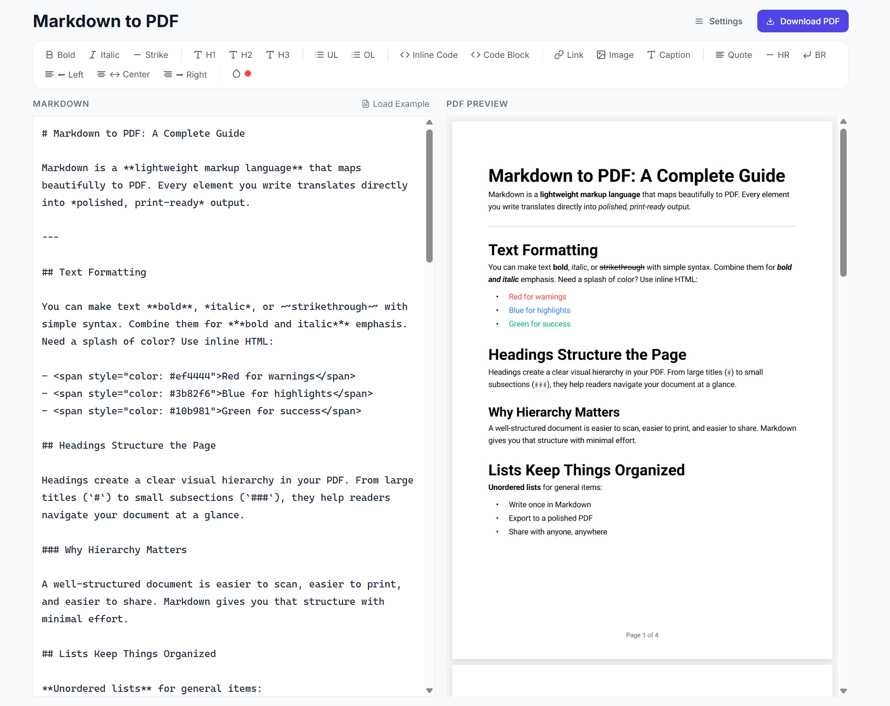

# MD to PDF

A production-grade Markdown-to-PDF converter built with React, Vite, TypeScript, and SCSS Modules.


**Live preview:** [pdf-from-md.netlify.app](https://pdf-from-md.netlify.app/)



Type Markdown on the left, watch a real vector PDF render on the right — not an HTML approximation of one. The editor pane parses your Markdown through a `unified`/`remark`/`rehype` pipeline, renders it straight into `@react-pdf/renderer` primitives (with `refractor`-powered syntax highlighting for code blocks), and paints the resulting PDF onto a canvas via `pdfjs-dist`. What you see in the preview is exactly what you download. Everything runs client-side — no backend, no upload.

## Features

- **True WYSIWYG Preview** — The preview pane renders the actual generated PDF (via `pdfjs-dist`), not a stand-in HTML rendering
- **Rich Formatting Toolbar** — Bold, italic, strikethrough, headings, lists, code blocks, blockquotes, links, images, colored text, and alignment
- **Vector PDF Export** — True vector PDFs with selectable text, generated by `@react-pdf/renderer`
- **GFM Support** — Tables, strikethrough, task lists, autolinks via `remark-gfm`
- **Syntax-Highlighted Code Blocks** — Powered by `refractor`, baked directly into the PDF
- **Custom Styling** — Background color, text color, page margins, and page size (A4 / Letter / Legal)
- **Decorative Background Patterns** — 48 selectable tiling icon patterns with configurable color, opacity, size, and spacing
- **Page Numbering** — Automatic "Page X of Y" footers with configurable labels and font size
- **Undo & Redo** — Full editor history (`Ctrl+Z` / `Ctrl+Shift+Z`, configurable history size)
- **Autosave** — Markdown and settings persist to `localStorage` between sessions
- **Responsive Design** — Works on desktop and mobile

## Quick Start

```bash
# Install dependencies
npm install

# Start the development server
npm run dev

# Run tests
npm test

# Build for production
npm run build
```

## Scripts

| Command                | Description                            |
| ---------------------- | -------------------------------------- |
| `npm run dev`          | Start Vite dev server                  |
| `npm run build`        | Type-check and build for production    |
| `npm run preview`      | Preview the production build locally   |
| `npm test`             | Run unit tests (Vitest)                |
| `npm run test:watch`   | Run tests in watch mode                |
| `npm run lint`         | Lint with ESLint                       |
| `npm run format`       | Format with Prettier                   |
| `npm run format:check` | Check formatting without writing files |

## Project Structure

```
src/
├── app/              # App shell (App.tsx, App.module.scss)
├── domain/           # Business logic
│   ├── components/   # Domain components (FormattingToolbar, PdfCanvasViewer, PdfDocument, PdfSettingsPanel)
│   ├── helpers/      # Pure functions (hastToPdf, parseInlineStyle, backgroundPatterns, fontRegistration, ...)
│   └── hooks/        # Custom hooks (useConverterSettings, useMarkdownParser, usePdfGenerator, useLivePdf, useUndoRedo, useToast)
├── pages/            # Route pages (Home, Converter, About)
├── routes/           # Route configuration with lazy loading
├── shared/           # Reusable UI components (Button, Input, Textarea, Select, Slider, ColorPicker, Toast, Navbar, Footer)
├── global-styles/    # Global styles and design tokens (theme.scss, animations.scss, ...)
└── tests/            # Test setup
```

## Tech Stack

- **Framework**: React 19 + TypeScript 5.9
- **Build Tool**: Vite 7
- **Styling**: SCSS Modules with a design token system
- **PDF Generation**: `@react-pdf/renderer` (vector PDF)
- **PDF Preview Rendering**: `pdfjs-dist` (renders the generated PDF to canvas for live preview)
- **Markdown Parsing**: `unified` + `remark-parse` + `remark-gfm` + `remark-rehype` + `rehype-raw`
- **Code Syntax Highlighting**: `refractor`
- **Routing**: React Router v7 (lazy-loaded routes)
- **Testing**: Vitest + Testing Library
- **Code Quality**: ESLint 9 (flat config) + Prettier + Husky + lint-staged

## Documentation

- [Getting Started](docs/getting_started.md)
- [Architecture](docs/architecture.md)
- [Design System](docs/design.md)
- [Contributing](docs/contributing.md)
- [Code Quality](docs/code_quality.md)

## License

MIT
